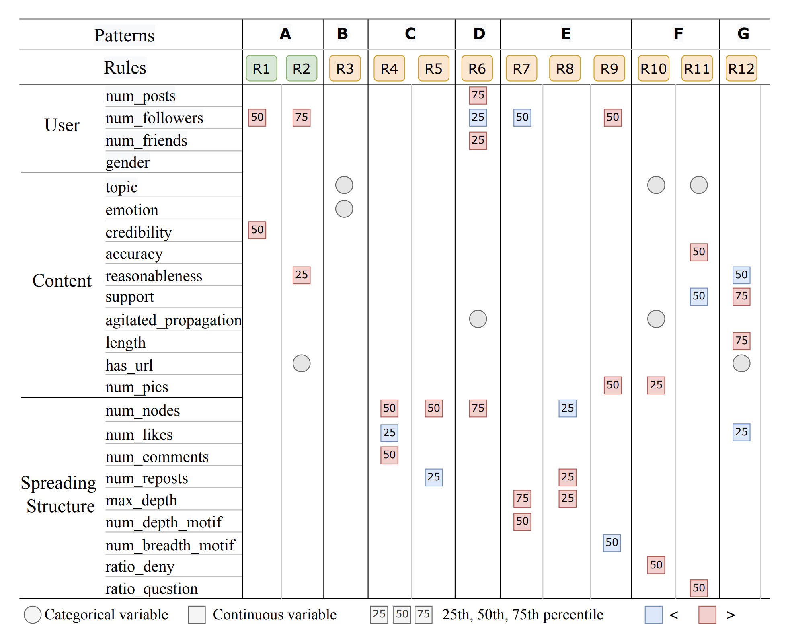

# RumorPatternDetection
Code for 2024 iConference Short Paper "Detecting the Rumor Patterns Integrating Features of User, Content, and the Spreading Structure"

Framework
---
## Overall Framework

## Pipeline of Latent Feature Extraction by LLM
---

Findings
---
This figure shows the categorized rumor patterns A-G and corresponding rules R1-R12. Each column represents a rule which consists of multiple conditions with variables listed in rows. For rules, colored green indicates non-rumorous, while orange represents rumors. For variables, `circle` represents categorical variable while `rectangle` represents a continuous variable. Numbers 25, 50, and 75 in rectangles represent the 25th, 50th, and 75th percentile of each variable. For continuous variables, red means "$>$" and blue means "$<$". For example, R1 represents "num\_followers $>$ 50\% percentile number of num\_followers \& credibility $>$ 50\% percentile number of credibility".

